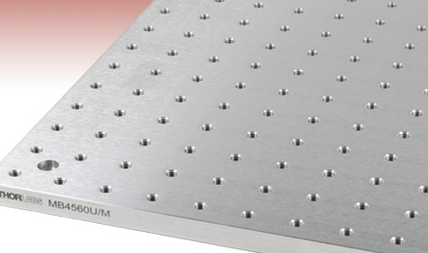
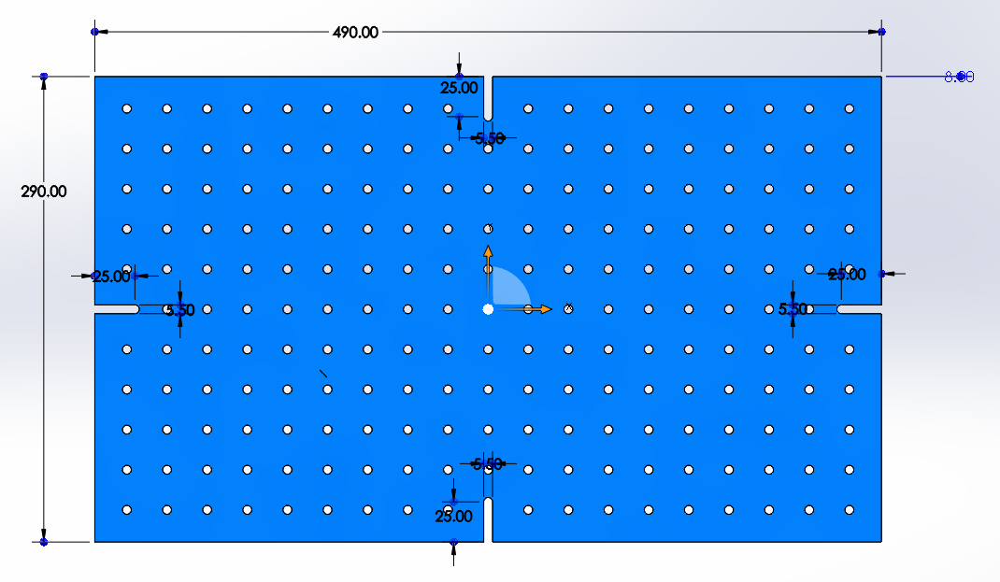
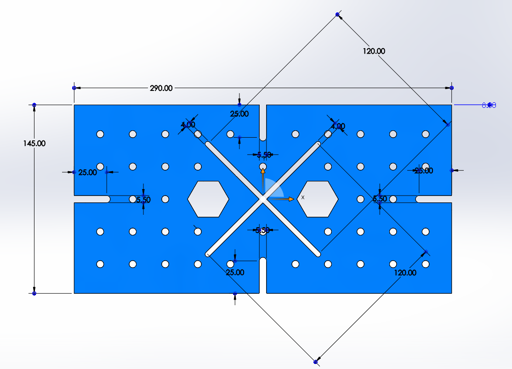
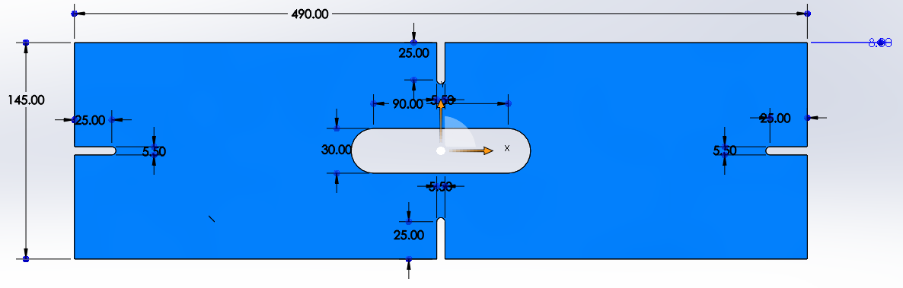
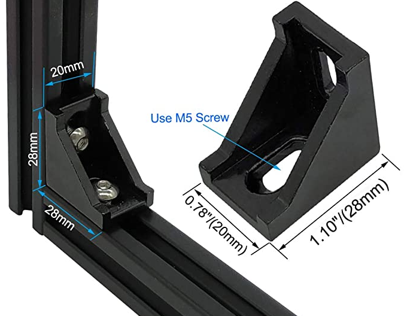
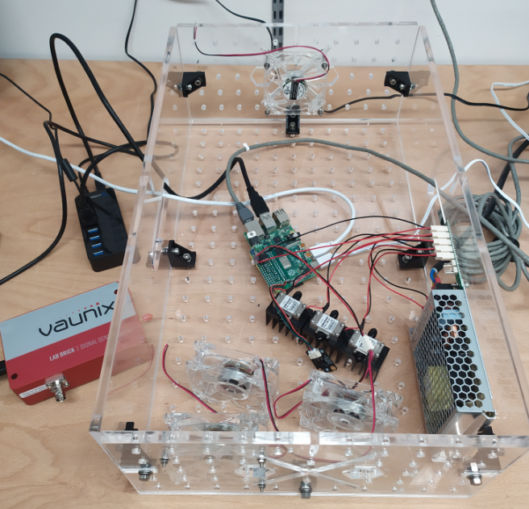
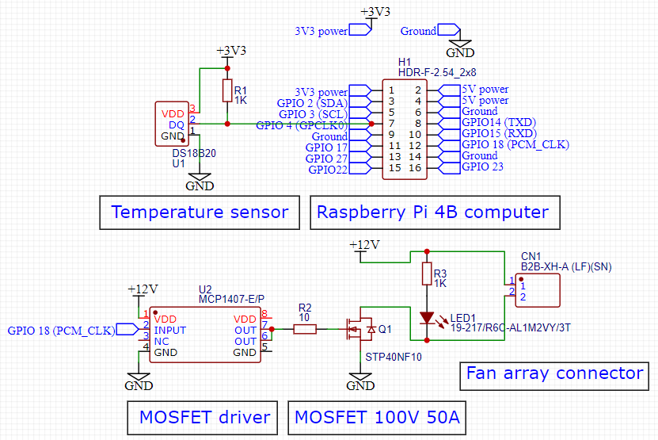
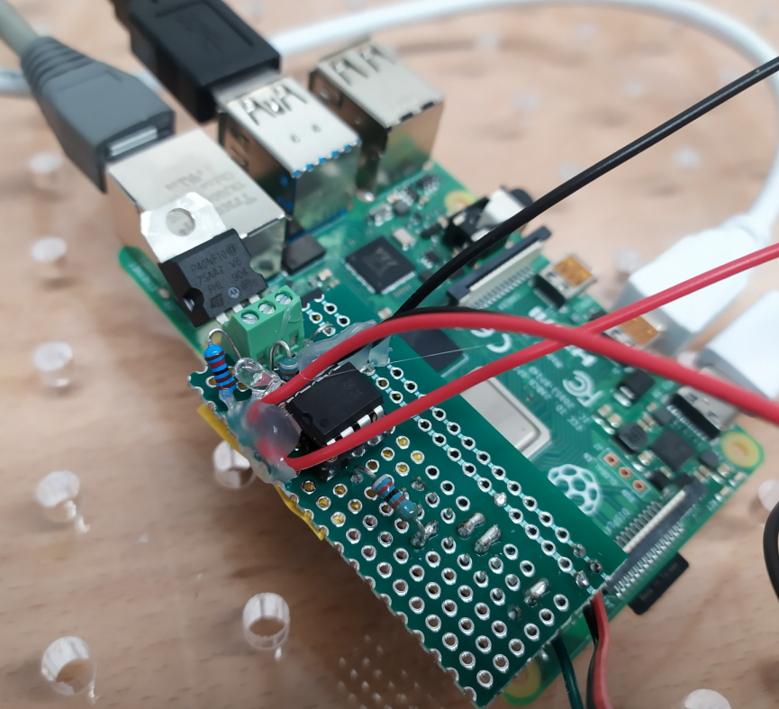
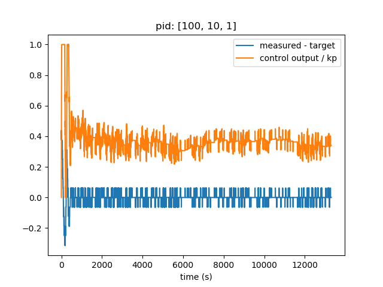

# How to make a simple temperature box to host your RF components for superconducting quantum computing

# [Read the better PDF verison here](./README.pdf)


## Part 1 Hardware

- The design follows the Optical Breadboards from Thorlabs



- First make SOLIDWORKS files like the following

              
 
 

- Then convert them into .DXF files and submit them to the mechanical workshop on level 1 of CQT 
	- 1.bottom.DXF,    2.side-long.DXF,    2.side-short.DXF

- The connection of these 3 parts are handled by standard 2020 Series Corner Brackets, I bought them from here on Amazon but the shipping took too long



- The assembled box looks like this, with test setup



## Part 2 Electronics

- The control is done by Raspberry Pi 4 Model B, it is not only used for a simple temperature control, but also chosen to handle possible future tasks, for example communicating with the Vaunix 4-8 GHz USB Programmable Signal Generator shown on the left.
- The fans operate at 12V so I made a hand soldered driver using parts found in the electronics workshop on level 2 of CQT, the schematic is  




## Part 3 Software

- First create 3 simple python libraries:
    - temperature.py for one-wire communication with the DS18B20 temperature sensor
    - pid.py for generating PID control amplitude
    - pwm.py for generating the physical PWM signals sent to the MCP1407 MOSFET driver

- Then the main script is app.py

```python
from lib.temperature import Temperature
from lib.pid import PID
from lib.pwm import PWM
import time

tem = Temperature()
pid = PID(target=25.5, pid=[100,10,1])
pid.reset(tem.get())
pwm = PWM()

while True:
    try:
        curTem = tem.get()
        duty = pid.step(curTem) 
        pwm.set(duty)
        print("tem: %.2f \t duty: %.2f" % (curTem,duty))
    except KeyboardInterrupt:
        pid.render()
```

- A test is performed with 3 ZVA-183-S+ 18 GHz Amplifiers running, the following is the measured temperature (minus target value) and the PID output (divided by Kp) overtime during the test, the temperature is stabilized with < 0.1 C fluctuation


